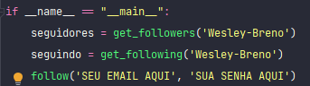
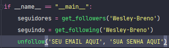

<h1 align="center">Analisador de seguidores do github</h1>

  

<h2 align="center">Descrição</h2>

  Programa feito em Python para fazer uma análise dos seguidores do usuário. O programa é responsavel por dar unfollow em quem nao segue o usuario de volta, tambem é
  possivel dar follow em quem o usuario ainda nao seguiu de volta. Metodos automatizados para o usuario nao se preocupar em ficar fazendo a gestao de seguidores.

<h2 align="center">Como usar?</h2>

  Para ter acesso ao projeto, basta baixar o codigo clicando neste link: https://github.com/Wesley-Breno/Analisa-seguidores-do-GitHub/archive/refs/heads/main.zip
   Apartir que o projeto for baixado, abra ele no seu editor de codigo e baixe os requerimentos do projeto e use o programa em seu projeto ou use diretamente do codigo do projeto. O programa usara a função print() para mostrar cada informação que foi pedida pelo usuario.

  <h3>Fazendo o programa dar follow em quem o usuario nao segue de volta</h3>
  
  
  <h3>Fazendo o programa dar unfollow em quem nao segue o usuario de volta</h3>
  

  <h4 align='center'>Lembre-se de chamar as funções get_followers e get_following e armazenar os seus retornos em uma variavel como esta na imagem acima</h4>

<h2 align="center">Tecnologias usadas</h2>

  
  
  
  

